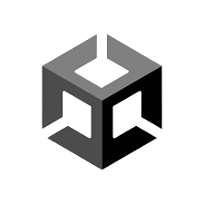

# Space Defenders

Space Defenders is mobile game set in space. You control a spaceship and fight off waves of enemies.

**Version Details**
---
- **Unity Editor Version**: 2021.3.19f1
- **Google Play**: not released **yet**
- **App Store**: not released

**Modes**
---
- **Protect Planet**: In this mode you need to protect the earth from waves of enemy spaceships.
- **Survival**: Survive enemy attacks in an infinite world.
- **Time Trial**: Kill is many enemies as you can in 1 minute.

**Online Features**
---
(hosted by [LootLocker](https://lootlocker.com/))
- **Leaderboard**: Compete against fellow players on the online leaderboards.
- **Level progression**: Level up to gain rewards.
- **Collectibles**: Collect in-game assets for stat-boosts.

**Licensing**
---
This project is open-source and all files are licensed under the Apache-2.0 License. You can read more in the [LICENSE](LICENSE) file.